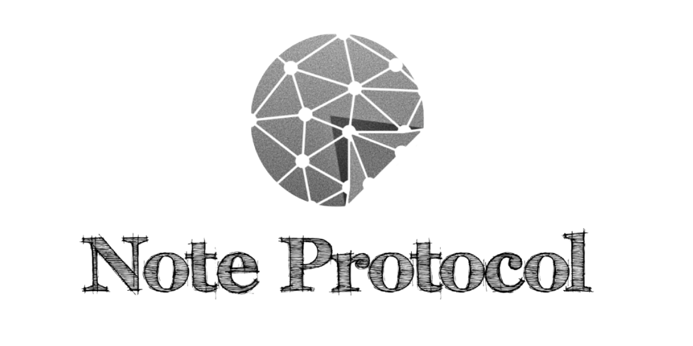

<!-- [English](./README-en.md) | 简体中文 -->

## 什么是 `Note protocol` 协议?
Note protocol是比特币上第一个智能合约解决方案。在比特币不做任何更改的前提下，采用链上资产确权+链下合约运行时的组合方式为比特币开起智能合约新时代。协议使用了比特币原生脚本功能（字节码 Opcodes），链下索引器，sCrypt高级编程语言以及BVM虚拟机等技术，由李龙团队贡献。2024年2月14日协议发行第一个资产币NOTE，总量2100万，采用固定bitwork(挖矿难度)与合约逻辑控制挖矿数量减半机制相结合的方式公开公平挖矿。

- [协议官网](https://noteprotocol.org/zh/)
- [浏览器](https://explorer.noteprotocol.org/)
- [协议文档](https://noteprotocol.org/zh/docs/protocol/)

## 资源链接

### 交易所
- [xt.com：第一个上线Note的cex](https://www.xt.com/zh-CN/trade/note_usdt)
- [utxo.exchange：dex，李龙团队出品，交易有积分，有空投预期](https://utxo.exchange/zh/n20)
- [notemarket.io：dex，社区贡献](https://alpha.notemarket.io/)

### 钱包
- [NoteWallet：命令行钱包，官方出品，Ts语言](https://github.com/NoteProtocol/NoteWallet)
- [pyNoteWallet：命令行钱包，社区贡献，Python语言](https://github.com/NoteScan/pyNoteWallet)
- [ChainBow：移动端钱包，李龙团队出品](https://chainbow.io/)
- [notemarket-wallet：chrome插件钱包，社区贡献](https://github.com/notemarketio/notemarket-wallet)
- [Okx wallet：欧易交易所的钱包，有chrome插件，移动端，桌面端](https://www.okx.com/zh-hans/web3)
- [Unisat：chrome插件钱包](https://chromewebstore.google.com/detail/unisat-wallet/ppbibelpcjmhbdihakflkdcoccbgbkpo?utm_source=ext_app_menu)
- [notebow：PC端note钱包，社区贡献](https://notebow.org/)

### 基础服务/工具
- [urchain：Bitcoin & Note api数据服务](https://btc.urchain.com/)
- [n20-connect：连接钱包套件](https://github.com/NoteScan/pyNoteWallet)
- [N-Deployer：N20代币部署程序](https://github.com/NoteScan/N-Deployer)
- [go-urchain：urchain服务的go sdk](https://github.com/xianb/go-urchain)
- [pyNoteMinter：Python写的挖矿程序](https://github.com/NoteScan/pyNoteWallet)
- [N20BulkSender：批量发送N20 Token](https://github.com/notenationio/N20BulkSender)

### 合约相关
- [快速开发合约教程](https://noteprotocol.org/zh/docs/tutorial/quick-start)
- [scryptdemo：离线智能合约开发模板](https://github.com/NoteProtocol/scryptdemo)
- [note-contract：智能合约开发模板](https://github.com/NoteProtocol/note-contract)
- [scrypt-verify：索引器的合约校验逻辑 ](https://github.com/NoteProtocol/scrypt-verify)
- [N20-WuKong：动态难度调节合约](https://github.com/NoteScan/N20-WuKong)
- [Scrypt官方文档](https://docs.scrypt.io/)
- [Scrypt medium文章](https://scryptplatform.medium.com/)

### 访谈/教程视频
- [对话Note Protoco李龙：BTC一层如何实现智能合约？](https://www.youtube.com/watch?v=1TFwDenQv7Y)
- [CAT20比特币智能合约入门](https://www.youtube.com/watch?v=D_TEgwvSw8g)
- [比特币UTXO模型智能合约入门](https://www.youtube.com/watch?v=odK4tYwYlaY)

### 科普文章
- [Note作者李龙个人博客](https://lilong.net/)
- [实现中本聪最初愿景？原教旨主义的Note Protocol将原生智能合约带进比特币生态](https://medium.com/@NoteNation/%E5%AE%9E%E7%8E%B0%E4%B8%AD%E6%9C%AC%E8%81%AA%E6%9C%80%E5%88%9D%E6%84%BF%E6%99%AF-%E5%8E%9F%E6%95%99%E6%97%A8%E4%B8%BB%E4%B9%89%E7%9A%84note-protocol%E5%B0%86%E5%8E%9F%E7%94%9F%E6%99%BA%E8%83%BD%E5%90%88%E7%BA%A6%E5%B8%A6%E8%BF%9B%E6%AF%94%E7%89%B9%E5%B8%81%E7%94%9F%E6%80%81-06e63e8b6350)
- [Note Protocol是如何让原生智能合约在比特币上运行的](https://medium.com/@NoteNation/note-protocol%E6%98%AF%E5%A6%82%E4%BD%95%E8%AE%A9%E5%8E%9F%E7%94%9F%E6%99%BA%E8%83%BD%E5%90%88%E7%BA%A6%E5%9C%A8%E6%AF%94%E7%89%B9%E5%B8%81%E4%B8%8A%E8%BF%90%E8%A1%8C%E7%9A%84-3506a47f3aa9)
- [为什么比特币需要智能合约？](https://medium.com/@NoteNation/%E4%B8%BA%E4%BB%80%E4%B9%88%E6%AF%94%E7%89%B9%E5%B8%81%E9%9C%80%E8%A6%81%E6%99%BA%E8%83%BD%E5%90%88%E7%BA%A6-0f8d037db51e)

### 测试网水龙头
- [testnet4.anyone.eu.org](https://testnet4.anyone.eu.org/)
- [mempool.space](https://mempool.space/zh/testnet4/faucet)
- [bitcoinfaucet.uo1.net](https://bitcoinfaucet.uo1.net/send.php)

### 技术支持
- [李龙推特账号](https://x.com/lilong)
- [电报群](https://t.me/NoteProtocol_org)
